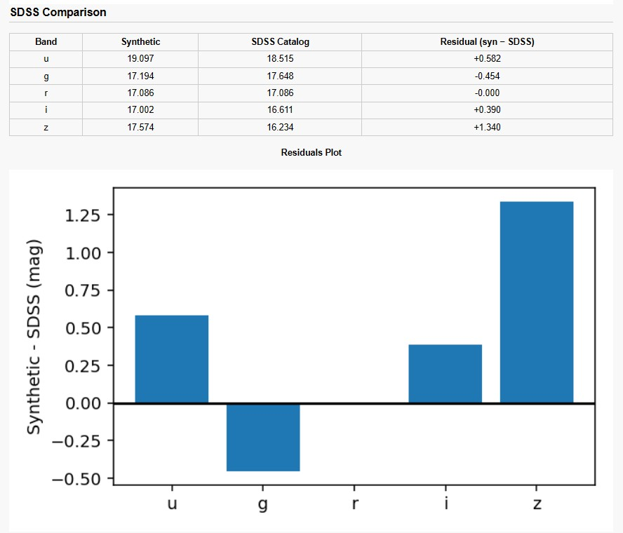

# 🌌 Astronomy Color Calculator  
### *A Synthetic Photometry Tool Using SDSS Filters*

🔗 **Live Web App:**  
👉 https://astro-color-calculator-4dao.onrender.com

This project is a fully functional **Astronomical Photometry Calculator** that converts different types of astrophysical inputs into **synthetic SDSS magnitudes and colours**.  
It uses real **SDSS (u, g, r, i, z) filter transmission curves**, performs **SED interpolation**, and provides **visual and numerical outputs**.

The tool is built using **Flask (Python)** and deployed online for direct use.

---

## ⭐ Features

### 🔭 **Multiple Input Modes**
You can compute synthetic photometry using any of the following:

- **Luminosity + Distance**  
  - Optional temperature for a **blackbody SED**
- **Integrated Flux** (erg s⁻¹ cm⁻²)  
- **AB Magnitude**
- **Upload SED File**  
  - Text (.txt/.dat) wavelength–flux table  
  - FITS spectrum  
- **Direct SDSS FITS URL**  
  - (spec-PLATE-MJD-FIBER format)

---

### 🎨 **Synthetic Photometry**
The calculator generates:

- SDSS magnitudes: **u, g, r, i, z**
- Colours:  
  - **u−g**, **g−r**, **r−i**, **i−z**
- Total integrated flux  
- SED plots with overlaid SDSS filters  
- Automatic unit handling (Astropy)

---

### 📊 **Comparison with SDSS Catalog Data**
You may optionally enter real SDSS PSF magnitudes.  
The tool will:

- Compare synthetic vs catalog magnitudes  
- Display a comparison table  
- Compute residuals (Synthetic − SDSS)  
- Generate a residual bar plot  

This makes it useful for:
- SED validation  
- Photometric consistency checks  
- Calibration experiments  

---

## 🖼️ Results & Screenshots

### 📌 **Dashboard**

---

### 📌 **SED Plot**

---

### 📌 **Comparison with SDSS**

---

## 💻 Technology Stack

- **Python (Flask)** — Web framework  
- **Astropy** — FITS reading & spectral units  
- **NumPy** — Interpolation & integration  
- **Matplotlib** — Scientific plots  
- **Gunicorn** — Production server  
- **Render.com** — Cloud deployment  

---

## 👨‍💻 Author

**Devarsh Prajapati**  
Aspiring Data Scientist | Astronomy & Python Enthusiast    

*Focused on bridging scientific computation with intuitive visual tools.*

---

If you like this, you can ⭐ the repo on GitHub!  
